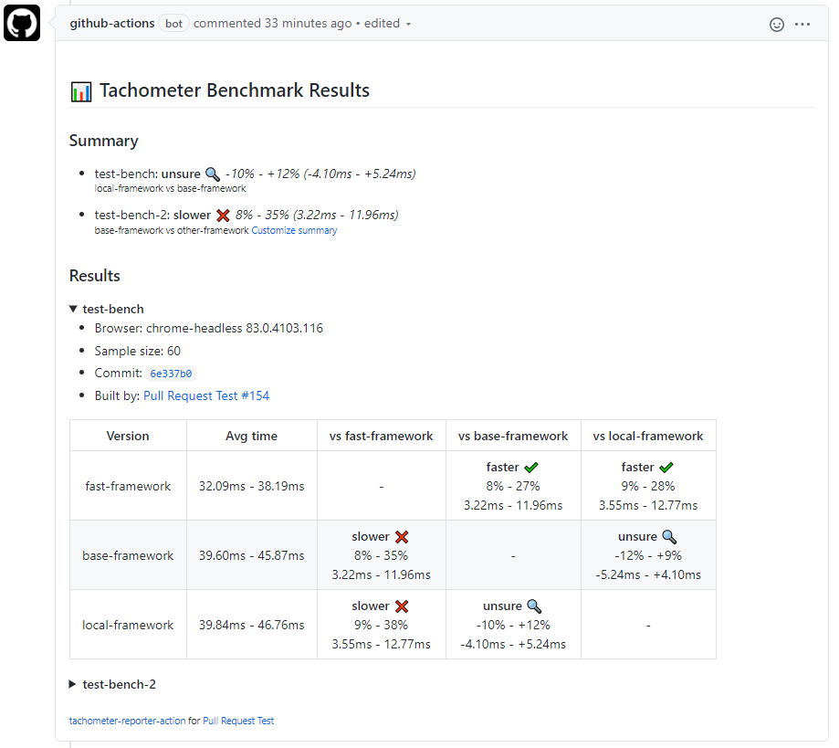
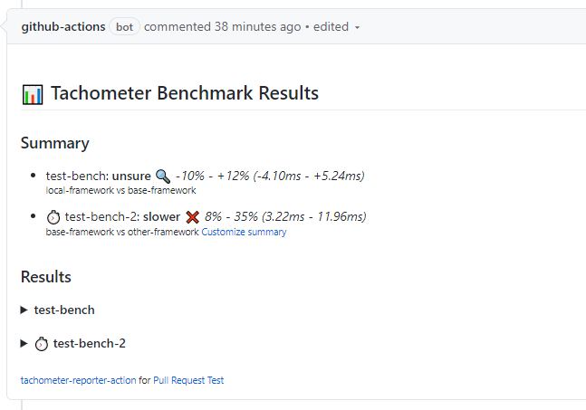

# tachometer-reporter-action

Report the results of
[Polymer/tachometer](https://github.com/polymer/tachometer) in a comment for
Pull Requests.

## Usage

```yaml
name: Pull Request Test

on: [pull_request]

jobs:
  pr_test:
    runs-on: ubuntu-latest

    steps:
      # Setup repo to run benchmarks
      - uses: actions/checkout@v2
      - uses: actions/setup-node@v1
      - run: npm ci

      # Run benchmarks
      - name: Run tachometer and generate results file
      - run: npm run tach --config benchmarks.json --json-file results.json

      # Read results and post comment
      - name: Report Tachometer Result
        uses: andrewiggins/tachometer-reporter-action@v1
        with:
          path: results.json
```

## Features

- Pick a summary of comparisons to highlight at the top
- See what benchmarks are currently running
- Keep a log of benchmark results from this PR

### Summary



`tachometer-reporter-action` will generate a summary of results for you if you
provide a `pr-bench-name` and `base-bench-name`. This summary will take the
results of comparing the results identified by the `pr-bench-name` vs. the
results identified by the `base-bench-name` and put them at the top of the of
the comment.

By default, if `pr-bench-name` or `base-bench-name` are not provided, then the
first two benchmarks in the tachometer results will be compared.

### In-progress benchmarks



If the `report-id` option is provided, then `tachometer-reporter-action` will
add a stopwatch icon (⏱) next to any benchmark that is currently running. The
icon is a link to the action job that is running the benchmark.

## Inputs

### Required

#### path

The path to the results JSON file of the tachometer run.

### Optional

#### report-id

Give this report (i.e. results file) an ID to uniquely identify it against other
instances of tachometer-reporter action. If you have multiple jobs or steps all
running tachometer-reporter action for the same PR, use this field so that the
actions don't collide with each other

#### default-open

Pass `true` to this option to automatically open this actions benchmark results
in the PR comment. By default, all results are collapsed.

#### keep-old-results

Pass `true` to this option to keep old benchmarks results in the PR comment
(collapsed under the latest results). By default, the action will override any
existing benchmark results with the latest results.

#### pr-bench-name

The benchmark or version (identified in Tachometer results by either the "name"
field or "version" field) which represents the changes made in this PR.

#### base-bench-name

The benchmark or version (identified in Tachometer results by either the "name"
field or "version" field) which serves as the base this PR is to be compared
against (e.g. the latest published version of your library/website).

## Notes

### Sorting

The results are inserted into the comment based on the index of the job that
produced the results. So a workflow that has multiple jobs reporting results
will show the results in the order the jobs are listed in the workflow yaml
file.

A single job reporting multiple results will list them in the order they finish.

### Only latest updates are shown

If you quickly push to a PR, two different workflow runs could be triggered at
close to the same time. Depending on how long the benchmarks take to run, the
earlier workflow run running not the latest code could complete after the later
workflow run running the latest code.

To prevent this situation, where older out-of-date results could override the
latest results, only results that come from a workflow run with a run number
equal or higher to the current run number in the comment will be written.

### Cooperative comment locking

If you action has multiple benchmarks running in different jobs, it is possible
that the reporter-action will try to overwrite each other's results if both jobs
read the comment before either has updated it with their results. In this
situation, both jobs get a view of the comment with no results and only adds
their results to the comment. The last job whose update is written would
override the update of the other job.

To mitigate this situation, this action implements a basic "locking" mechanism
on the comment. Before any job can make significant changes to the comment, it
must first write an empty `span` to the comment with an ID and wait a short time
to ensure all other jobs have seen it's `span`, claiming the comment as locked.
if another job sees that this `span` exists, it will wait a random amount of time
before trying to acquire the comment lock for itself. This protocol is perfect,
but it is likely good enough for our purposes.
